<br>
A tool for discovering and evolving patterns in a 6 channel MNCA rulespace.

## MNCA origins ([source](https://slackermanz.com/understanding-multiple-neighborhood-cellular-automata/))
MNCA (Multiple Neighborhood Cellular Automata) is a family of cellular automata, created by Slackermanz. Please check the source for a more in depth explanation of MNCA.
#### Conway's Game of Life
MNCA is built upon the principles of Conway's Game of Life, created by John Conway in 1970. To better understand MNCA, we can take a look at the simple rules that govern CGOL. For each cell in our grid, we take the **sum of "neighbors"** (# of alive / filled cells among the 8 surrounding cells) and do the following at each frame / timestep (neighboring cells' updates not shown):
<table>
  <tr>
    <td align="center" width="20%">
      t = 0
    </td>
    <td align="center" width="20%">
      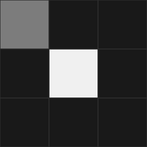<br>
    </td>
    <td align="center" width="20%">
      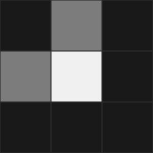<br>
    </td>
    <td align="center" width="20%">
      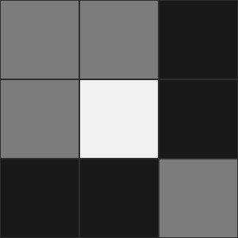<br>
    </td>
    <td align="center" width="20%">
      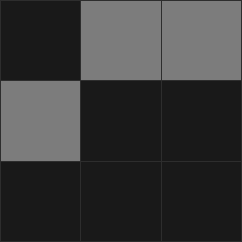<br>
    </td>
  </tr>
  <tr>
    <td align="center" width="20%">
      t = 1
    </td>
    <td align="center" width="20%">
      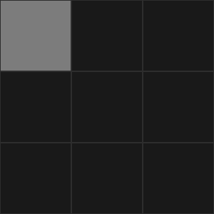<br>
    </td>
    <td align="center" width="20%">
      <br>
    </td>
    <td align="center" width="20%">
      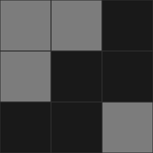<br>
    </td>
    <td align="center" width="20%">
      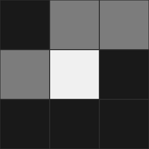<br>
    </td>
  </tr>
  <tr>
    <td align="center" width="20%">
    </td>
    <td align="center" width="20%">
      <2 neighbors: die
    </td>
    <td align="center" width="20%">
      2-3 neighbors: survive
    </td>
    <td align="center" width="20%">
      >3 neighbors: die
    </td>
    <td align="center" width="20%">
      3 neighbors: birth
    </td>
  </tr>
</table>

<table>
  <tr>
    <td align="center" width="100%">
      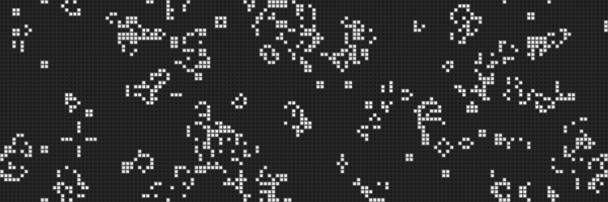<br>
    </td>
  </tr>
  <tr>
    <td align="left" width="100%">
      The rules in action
    </td>
  </tr>
</table>

#### Expansion to MNCA
MNCA makes two major expansions from Conway's Game of Life, those being larger neighborhoods and the use of two or more such neighborhoods, each with their own set of rules. Take the following example pair of neighborhoods:
<table>
  <tr>
    <td align="center" width="50%">
      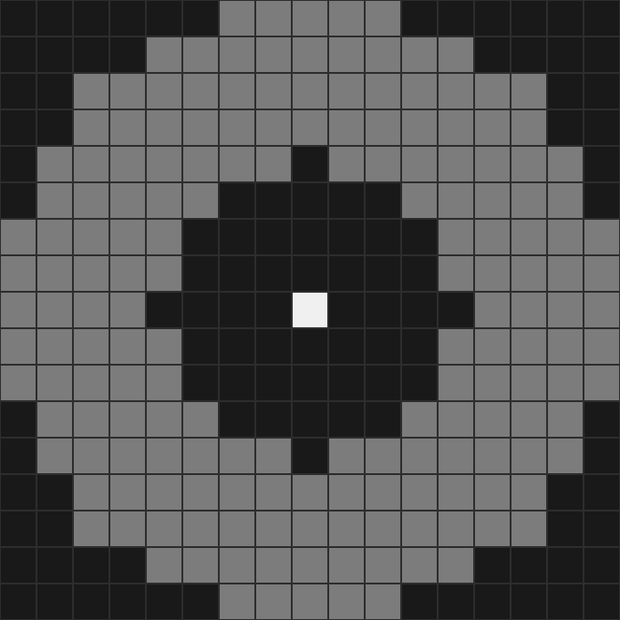<br>
    </td>
    <td align="center" width="50%">
      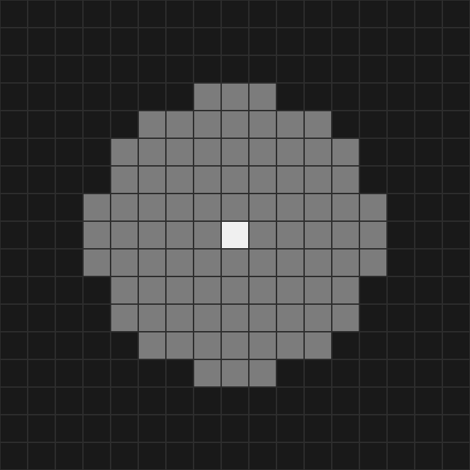<br>
    </td>
  </tr>
  <tr>
    <td align="center" width="50%">
      Neighborhood A
    </td>
    <td align="center" width="50%">
      Neighborhood B
    </td>
  </tr>
</table>
The simplest way to implement MNCA is to apply a similar rule scheme to CGOL to each neighborhood (a 1/alive or 0/dead depending on the sum of neighbors for each neighborhood). However, we can also utilize a continous space by storing float values [0.0, 1.0] in each cell. We then have a float neighborhood sum as well as a fixed/parameterized weight we add to the target cell (rather than setting 1 or 0).

```
# Continuous MNCA Ruleset Skeleton Example

For each cell:
  If Neighborhood A sum between (a, b):
    cell += weight1
  If Neighborhood A sum between (c, d):
    cell += weight2
  If Neighborhood B sum between (e, f):
    cell += weight3
  If Neighborhood B sum between (g, h):
    cell += weight4
  ...
```
#### Selective MNCA
Selective MNCA (also by Slackermanz) is a variant of MNCA in which we calculate multiple "candidate" MNCA patterns/rulesets per cell per frame, and use some function to score each ruleset and pick one for that particular cell and frame. SMNCA massively increases the parameter space and expressive capability of MNCA. Here are some patterns I discovered while working in a single channel, continous SMNCA rulespace. The selection function for these patterns always awards the candidate pattern that changes the target cell's value the most.
<table>
  <tr>
    <td align="center" width="25%">
      <br>
    </td>
    <td align="center" width="25%">
      <br>
    </td>
    <td align="center" width="25%">
      <br>
    </td>
    <td align="center" width="25%">
      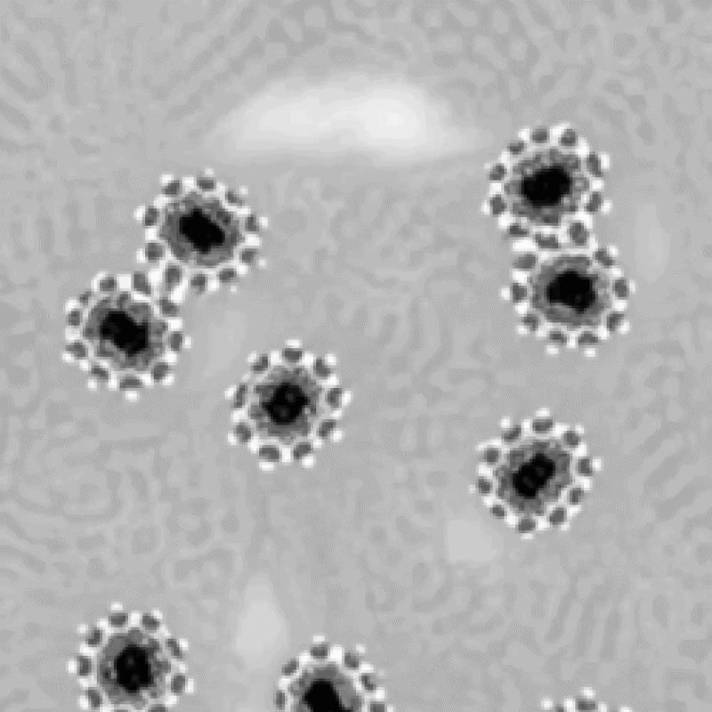<br>
    </td>
  </tr>
</table>

## My rulespace

The rulespace used for this tool is a cross-channel variant of the SMNCA family with 6 channels (RGB + 3 channels). A single ruleset is structured as follows:
```
Candidate 0
  - 2 neighborhoods
  - 4 threshold (lo, hi) pairs
  - 8 channel mix sextets (4 read, 4 write)
Candidate 1
Candidate 2
Candidate 3

For each channel, select the candidate with greatest change to said channel.
```
To understand how these rules work, we can take a look at a specific pattern in the space.
<table>
  <tr>
    <td align="center" width="50%">
      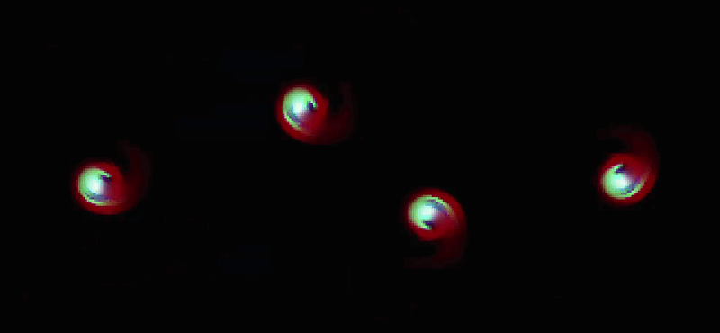<br>
    </td>
  </tr>
  <tr>
    <td align="left" width="100%">
      Sample pattern
    </td>
  </tr>
</table>

#### Neighborhoods

Neighborhoods are randomly selected as 12-long binary sequences. A "1" at the nth bit in our sequence inidicates the inclusion of radius n in our neighborhood. Here are the 8 neighborhoods (2 / candidate) included in the above pattern.

<table>
  <tr>
    <td align="center" width="25%">
      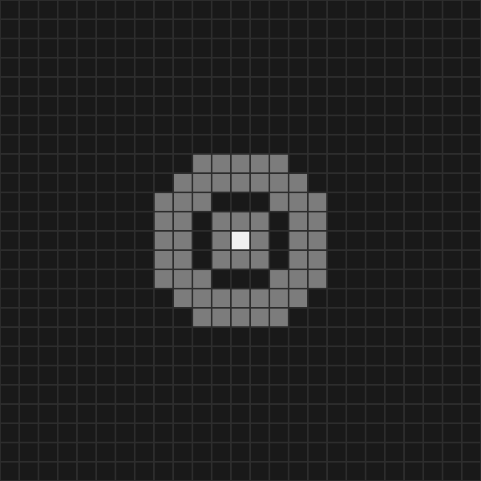<br>
    </td>
    <td align="center" width="25%">
      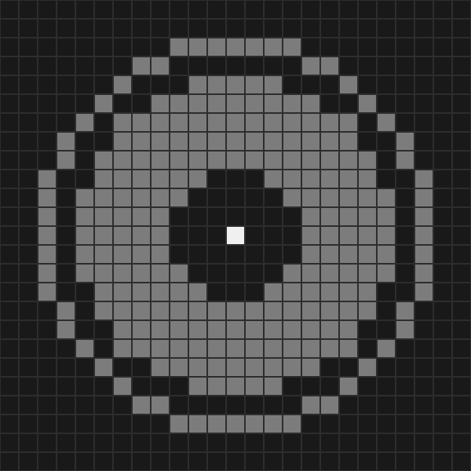<br>
    </td>
    <td align="center" width="25%">
      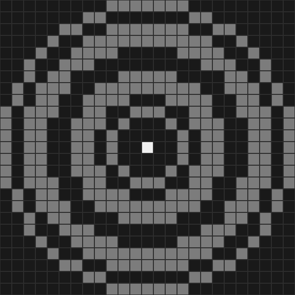<br>
    </td>
    <td align="center" width="25%">
      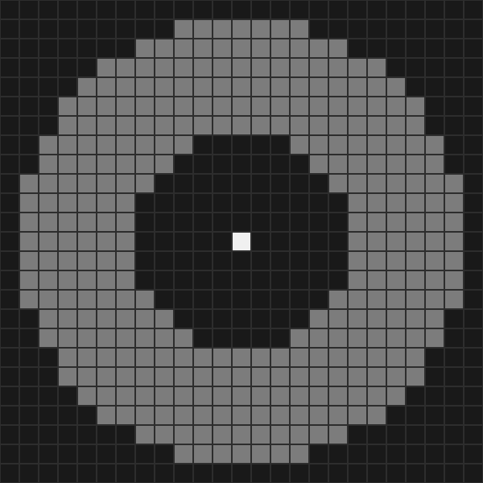<br>
    </td>
  </tr>
  <tr>
    <td align="center" width="25%">
      C0 Neighborhood A: 000000001101
    </td>
    <td align="center" width="25%">
      C0 Neighborhood B: 001011111000
    </td>
    <td align="center" width="25%">
      C1 Neighborhood A: 101100110100
    </td>
    <td align="center" width="25%">
      C1 Neighborhood B: 011111100000
    </td>
  </tr>
  <tr>
    <td align="center" width="25%">
      <br>
    </td>
    <td align="center" width="25%">
      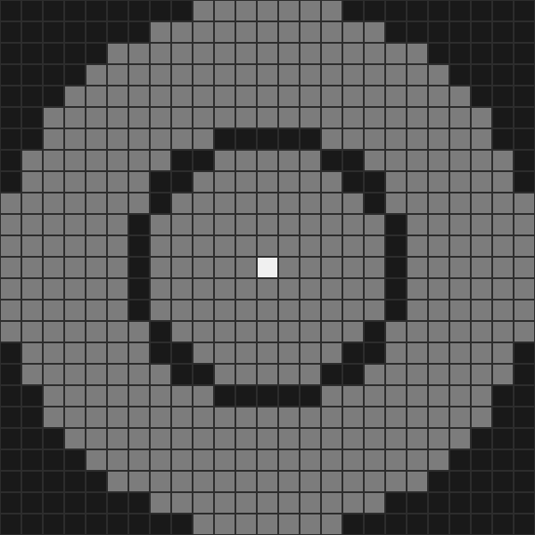<br>
    </td>
    <td align="center" width="25%">
      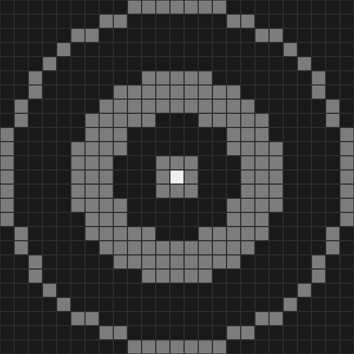<br>
    </td>
    <td align="center" width="25%">
      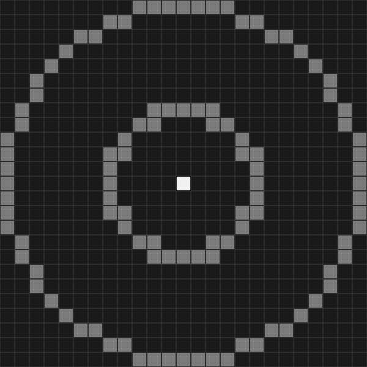<br>
    </td>
  </tr>
  <tr>
    <td align="center" width="25%">
      C2 Neighborhood A: 000001100000
    </td>
    <td align="center" width="25%">
      C2 Neighborhood B: 111111011111
    </td>
    <td align="center" width="25%">
      C3 Neighborhood A: 100001110001
    </td>
    <td align="center" width="25%">
      C3 Neighborhood B: 100000010000
    </td>
  </tr>
</table>

#### Rules

Each neighborhood has two corresponding "rules". A rule consists of a **threshold pair** (lo, hi), one **read sextet** and one **write sextet**. A rule takes the neighborhood average (neighborhood sum / neighborhood area) and compares it to the thresholds to decide whether to update the target cell. 

In our rulespace, rule 1 of a neighborhood always increments the target while rule 2 always decrements the target. This roughly ensures that the pattern is not biased towards gamma 1 or 0.

Let's look at rule 1 of candidate 1's B neighborhood. 
```
lo, hi = 0.3098, 0.7098

read  sextet: [0.1373, 0.1916, 0.1654, 0.0000, 0.3346, 0.1711]
write sextet: [0.0036, 0.3863, 0.2323, 0.0568, 0.2110, 0.1101]
```

## Tool capabilities

#### Pattern mutation

#### Parameter map

## Gallery
<table>
  <tr>
    <td align="center" width="33%">
      <br>
    </td>
    <td align="center" width="33%">
      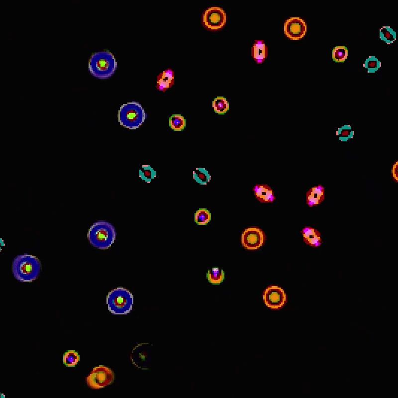<br>
    </td>
    <td align="center" width="33%">
      <br>
    </td>
  </tr>
    <tr>
    <td align="center" width="33%">
      <br>
    </td>
    <td align="center" width="33%">
      <br>
    </td>
    <td align="center" width="33%">
      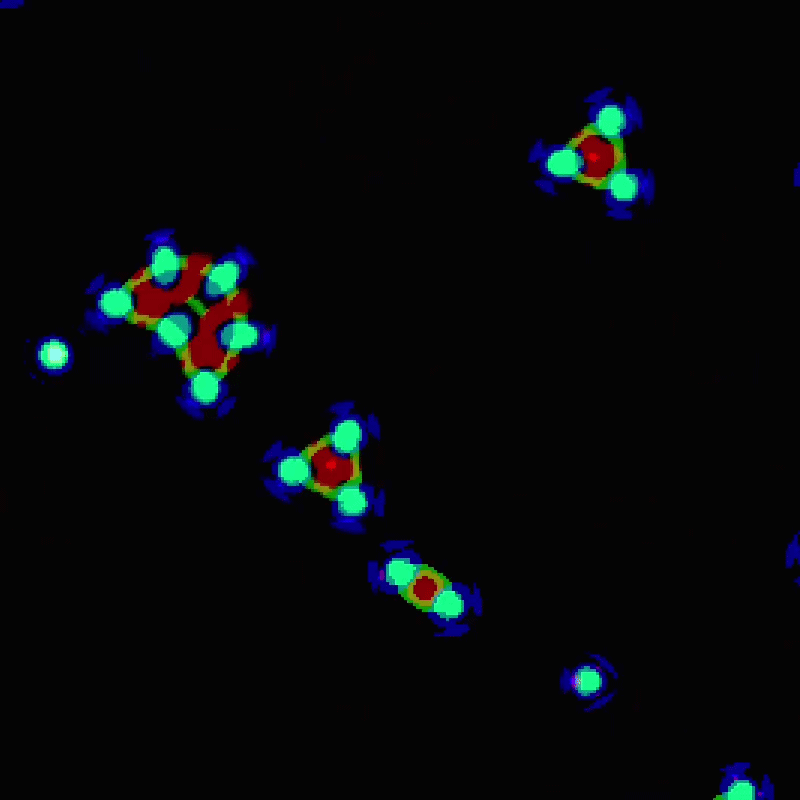<br>
    </td>
  </tr>
    <tr>
    <td align="center" width="33%">
      <br>
    </td>
    <td align="center" width="33%">
      <br>
    </td>
    <td align="center" width="33%">
      <br>
    </td>
  </tr>
    <tr>
    <td align="center" width="33%">
      <br>
    </td>
    <td align="center" width="33%">
      <br>
    </td>
    <td align="center" width="33%">
      <br>
    </td>
  </tr>
    <tr>
    <td align="center" width="33%">
      <br>
    </td>
    <td align="center" width="33%">
      <br>
    </td>
    <td align="center" width="33%">
      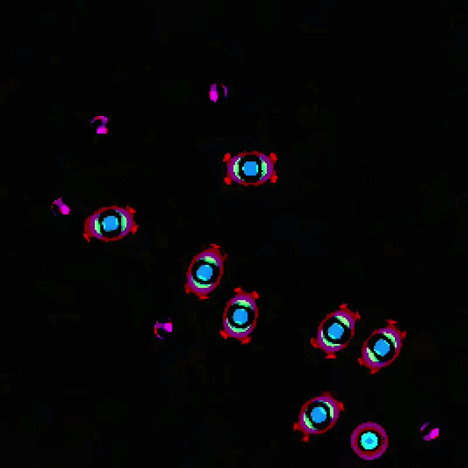<br>
    </td>
  </tr>
    <tr>
    <td align="center" width="33%">
      <br>
    </td>
    <td align="center" width="33%">
      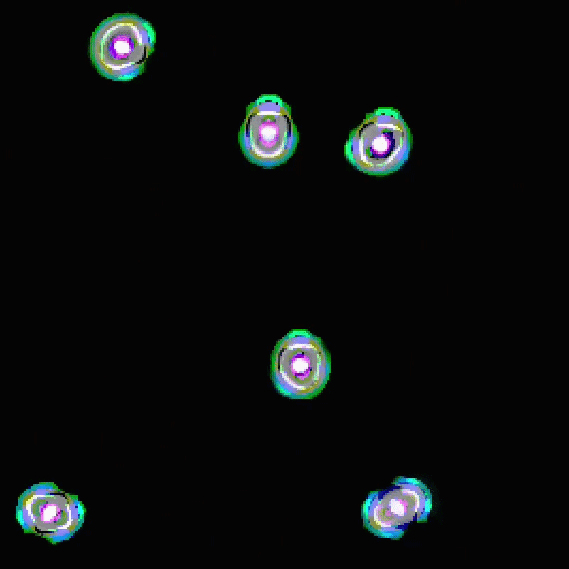<br>
    </td>
    <td align="center" width="33%">
      <br>
    </td>
  </tr>
    <tr>
    <td align="center" width="33%">
      <br>
    </td>
    <td align="center" width="33%">
      <br>
    </td>
    <td align="center" width="33%">
      <br>
    </td>
  </tr>
</table>
